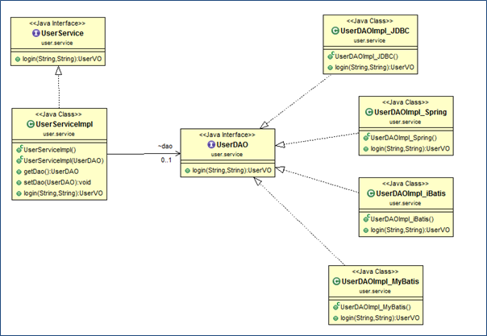
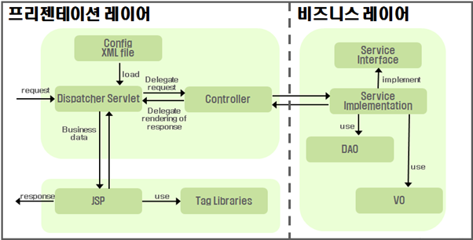
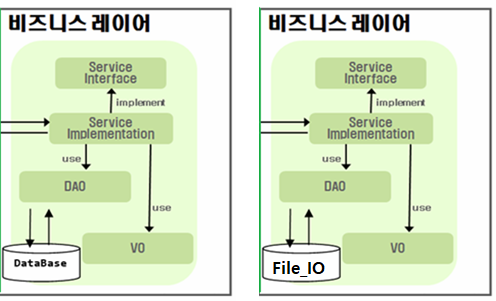

# 2024_09

##  다운로드
#### 설치 file download : <http://naver.me/x2jhvtyp> 
#### 교재 예제 소스 다운로드 : <https://www.hanbit.co.kr/support/supplement_survey.html?pcode=B1041700089> 
#### 교재 예제 소스 git : <https://github.com/cloudstudying-kr/> 
####  

  
## 클래스다이어그램

  
## 서비스레이어구축

 
## 

