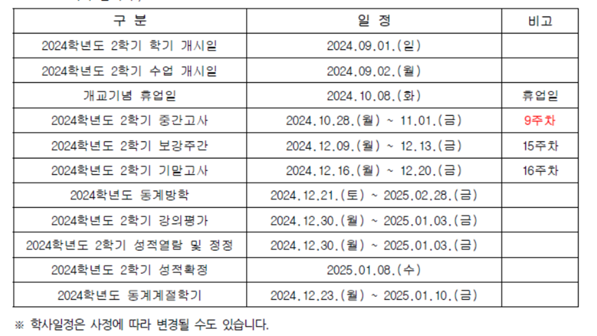
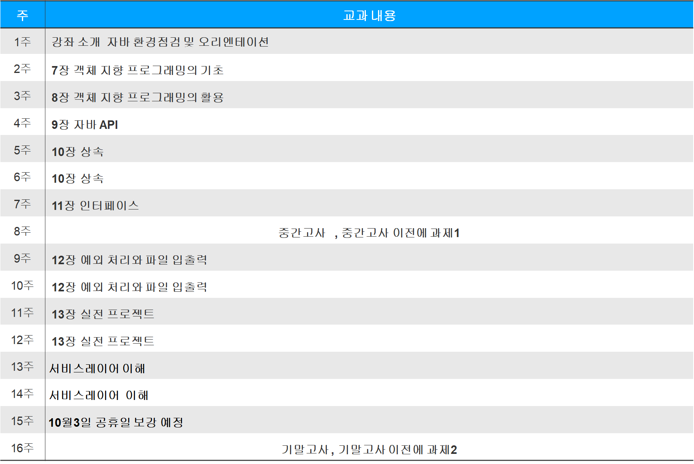

# 2024_09_05

  
## 

 
## 

 
## 

 
 

자바환경설치 바탕화면에 설치는 금지

1. jdk 8.X/ jdk 17 install

2.  JAVA_HOME 설정,    path 설정, class path 
    JAVA_HOME=C:~~~jdk17
    path=%JAVA_HOME%\bin;
    class path : .;~~~.jar

3. eclipse 설치:  https://www.eclipse.org/downloads

4. 워크스페이스폴더결정
5: 인코딩설정  : UTF-8
      general / workspace =>인코딩  UTF-8
      web     / html   =>인코딩  UTF-8
       css    =>인코딩  UTF-8
	jsp    =>인코딩  UTF-8

.ini 환경설정
-Dfile.encoding=UTF-8

6. 이클립스환경설정에서  installed jre  확인

