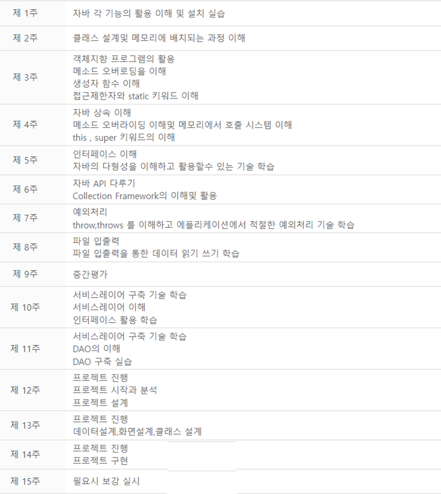

# 2024_09_05

  
## 

 
## 

 
## 

 
 

자바환경설치 바탕화면에 설치는 금지 

1. jdk 8.X/ jdk 17 install 

2.  JAVA_HOME 설정,    path 설정, class path  
    JAVA_HOME=C:~~~jdk17 
    path=%JAVA_HOME%\bin; 
    class path : .;~~~.jar 

3. eclipse 설치:  https://www.eclipse.org/downloads 

4. 워크스페이스폴더결정
5: 인코딩설정  : UTF-8 
      general / workspace =>인코딩  UTF-8 
      web     / html   =>인코딩  UTF-8 
      css    =>인코딩  UTF-8 
      jsp    =>인코딩  UTF-8 

.ini 환경설정 
-Dfile.encoding=UTF-8 

6. 이클립스환경설정에서  installed jre  확인 

